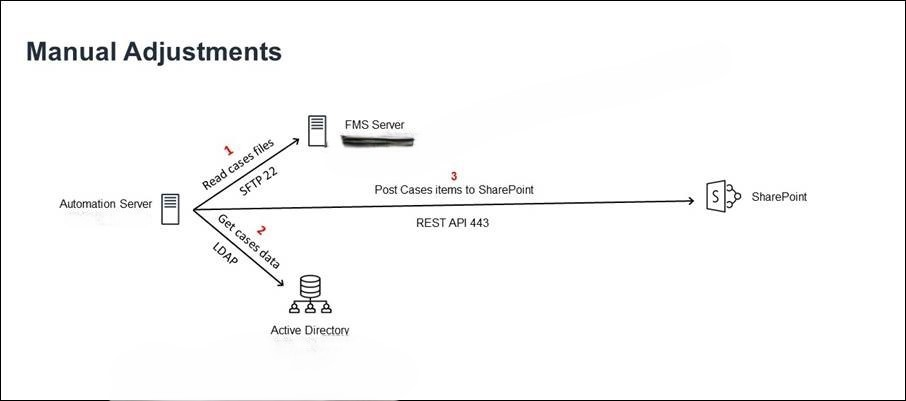
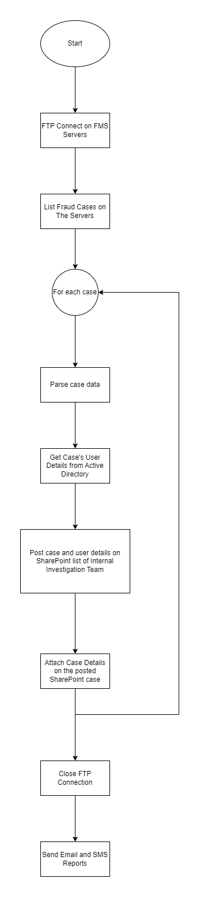

[![LinkedIn][linkedin-shield]][linkedin-url]

<!-- PROJECT LOGO -->
 

  
  <h3 align="center">Agent Fraud Cases Automation</h3>

<!-- TABLE OF CONTENTS -->

  
Table of Contents

  <ol>
    <li>
      <a href="#about-the-project">About The Project</a>
      <ul>
        <li><a href="#business-case">Business Case</a></li>
        <li><a href="#technical-solution">Technical Solution</a></li
        <li><a href="#flowchart">Flowchart</a></li>
        <li><a href="#tech-stack">Tech Stack</a></li>
      </ul>
    </li>
    <li><a href="#contact">Contact</a></li>
  </ol>

<!-- ABOUT THE PROJECT -->
## About The Project

* Project Name: Agent Fraud Cases Automation
* Version: v1.0.0
* Organization Department: Technology

### Business Case
Agents dealing directly with customers have an allowance
to compensate for balance issues.

Some agents misuse this allowance for fraud activities, converting it for personal gain or on behalf of their relatives.

The Anti-Fraud team employs a Fraud Management System (FMS) to detect and capture these fraud cases, forwarding them via email for further investigation.

(<a href="#readme-top">back to top</a>)

### Technical Solution
Initially, the Anti-Fraud team manually checked their mailboxes for fraud cases and submitted them to the Internal Investigations SharePoint list.

The project involved collaborating with the FMS team to submit cases as files to their servers. I then developed a backend automation to retrieve, process, and submit these cases to the Internal Investigations SharePoint list.

Due to concerns about data integrity, the security committee recommended against pulling cases into our server. To address this, I implemented a solution to remotely access the FMS servers and process the cases in place, gaining approval from the security committee.

Finally, I developed an automated mail report and SMS to communicate the status of each execution, meeting the specific requirements of the Anti-Fraud team.

(<a href="#readme-top">back to top</a>)

### Flowchart

(<a href="#readme-top">back to top</a>)

### Tech Stack

This project was developed using the following tech stack:

* Python

(<a href="#readme-top">back to top</a>)

<!-- CONTACT -->
## Contact

Mohamed AbdelGawad Ibrahim - [@m-abdelgawad](https://www.linkedin.com/in/m-abdelgawad/) - <a href="tel:+201069052620">+201069052620</a>

(<a href="#readme-top">back to top</a>)

<!-- MARKDOWN LINKS & IMAGES -->
<!-- https://www.markdownguide.org/basic-syntax/#reference-style-links -->
[linkedin-shield]: https://img.shields.io/badge/-LinkedIn-black.svg?style=for-the-badge&logo=linkedin&colorB=555
[linkedin-url]: https://www.linkedin.com/in/m-abdelgawad/
